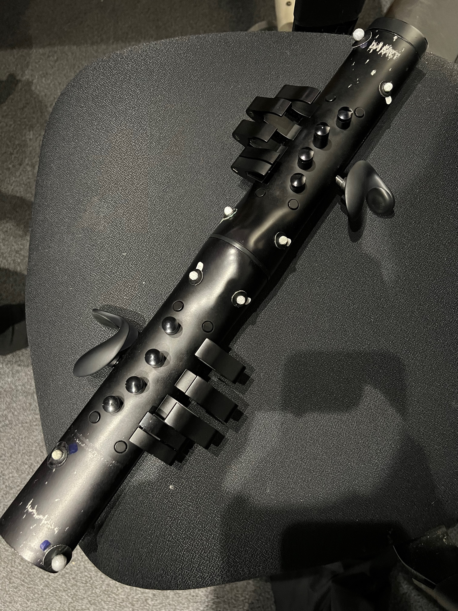

# Karlax_MOCAP_Data

This repo contains the MOCAP data extracted from the performance of the piece "Instrumental Interaction Ⅳ subtitled 4 studies for Karlax solo", composed by Benjamin Lavastre in 2023.
The data was extracted using the Qualysis mocap system with 11 oqus 400 and 700 series motion capture cameras.

## Goal
Our goal is to identify the gestures used during performance and run another capture session in a few months to compare the differences in gestures of a more rehearsed and memorized performance.
Since the piece contains a score and is not improvisatory, it becomes a repeatable environment where the performer can rehearse and create a set of gestures that follows the piece.

## Future Work
Analyse the current data and identify the gestures.
